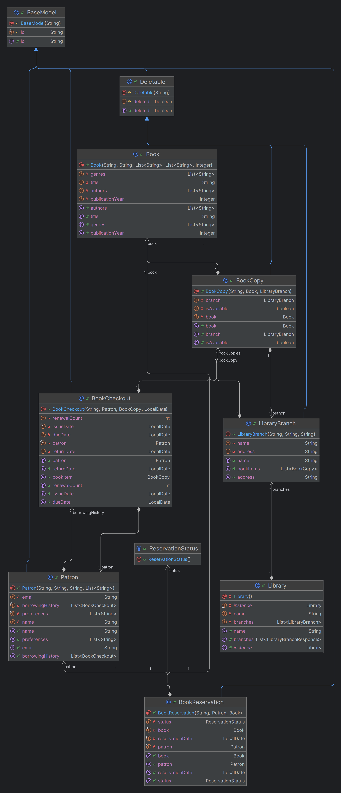

# Library Management System

## Overview

This Java-based Library Management System provides a comprehensive solution for managing books, patrons, and lending processes across multiple library branches. It demonstrates the application of Object-Oriented Programming concepts, SOLID principles, and relevant design patterns.

## Features

- Book Management: Add, remove, update, and search for books
- Patron Management: Add, update patrons and track borrowing history
- Lending Process: Checkout and return books
- Inventory Management: Track available and borrowed books
- Multi-branch Support: Manage multiple library branches and transfer books
- Reservation System: Allow patrons to reserve books and receive notifications
- Recommendation System: Generate book recommendations based on patron history

## Technical Highlights

- Implements OOP concepts: inheritance, encapsulation, polymorphism, abstraction
- Applies SOLID principles for maintainable and extensible design
- Utilizes design patterns: Factory, Strategy, Singleton
- Uses Java collections (List, Map) for efficient data management
- Includes a custom logging framework for event and error tracking

## Project Structure

- `model/`: Data models (Book, Patron, etc.)
- `service/`: Business logic services
- `repository/`: Data access layer
- `command/`: Command pattern implementation for user interactions
- `exception/`: Custom exceptions
- `util/`: Utility classes

## Class Diagram

## How to Run

1. Compile the Java files
2. Run the `AirLibSystem` class
3. Follow the console prompts to interact with the system

## Key Commands

- `ADD-BOOK`: Add a new book
- `CHECKOUT-BOOK-COPY`: Checkout a book
- `RETURN-BOOK-COPY`: Return a book
- `SEARCH-BOOKS`: Search for books
- `ADD-PATRON`: Add a new patron
- `PRINT-PATRON`: Display patron information
- `HELP`: View all available commands

## Contributors

ibn-e-battuta